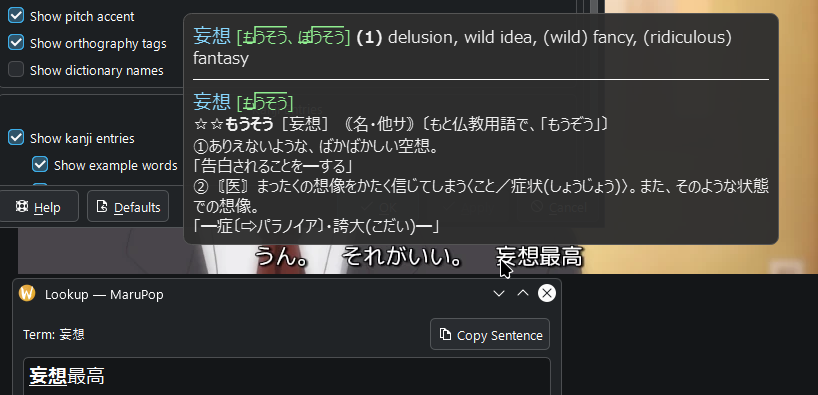

<!-- SPDX-FileCopyrightText: 2026 marunine -->
<!-- SPDX-License-Identifier: LGPL-3.0-only -->
# MaruPop

MaruPop is an OCR pop-up Japanese dictionary for KDE Plasma 6 on Wayland.
Hyprland support is experimental.



## Features

- Horizontal and vertical Japanese text recognition.
- Lookup of conjugated verbs and adjectives.
- Post-processing correction of OCR results and similarity (variant) lookup.
- Integrated download and update for JMdict, JMnedict, and KANJIDIC2.
- Yomitan dictionary imports, including frequency and pitch accent data.
- Custom word and name lists in JL tab-separated format.
- Customizable colors, fonts, and content display settings.
- Global shortcuts for scanning, copying words, and pinning the popup.

## Building and installing

MaruPop requires a native installation for KDE Plasma 6 or Hyprland on Wayland.

Required build dependencies for both KDE Plasma and Hyprland:

- C compiler and C++20 compiler
- CMake 3.25 or later
- Ninja
- pkg-config
- extra-cmake-modules 6.12 or later
- Qt 6.7 or later with Widgets, DBus, Concurrent, Network, and Sql
- KDE Frameworks 6.12 or later
- LayerShellQt
- Wayland client library and headers, version 1.20 or later
- wayland-scanner
- ONNX Runtime
- OpenCV 5
- SQLite 3
- xxHash
- GNU gettext
- GoogleTest and Qt Test, when building tests

KDE Frameworks and LayerShellQt are required for both desktops.

### Arch Linux

Install the build dependencies:

```sh
sudo pacman -S --needed \
    gcc git cmake ninja pkgconf gettext extra-cmake-modules \
    qt6-base \
    karchive kcolorscheme kconfig kconfigwidgets kcoreaddons kcrash kdbusaddons kglobalaccel \
    kguiaddons ki18n kio kjobwidgets knotifications kservice kstatusnotifieritem \
    kwidgetsaddons kxmlgui \
    layer-shell-qt wayland onnxruntime-cpu opencv sqlite xxhash gtest
```

### Build and install

Run from the repository folder:

```sh
cmake -B build -G Ninja -DCMAKE_INSTALL_PREFIX=/usr
cmake --build build
sudo cmake --install build
kbuildsycoca6
marupop
```

### Experimental Hyprland setup

Hyprland detection is automatic.
The session requires a tray with support for StatusNotifierItem to access the menu.

Run the configuration check:

```sh
marupop --check-authorization
```

Add the reported `no_screen_share` layer rule to your Hyprland configuration.
The rule prevents MaruPop from recognizing text in its own popup.

If permission enforcement is enabled, also add the reported `screencopy` permission rule.
The permission rule must name the binary you run.

Open **Configure MaruPop… → Shortcuts** to copy the shortcut bindings.

Add the bindings to your Hyprland configuration, then reload the configuration.
MaruPop provides configuration lines for `hyprland.lua` or `hyprland.conf`.

Text covered by the popup is unavailable for recognition on Hyprland.
MaruPop places the popup away from the recognized paragraph by default.

## First run

Models and dictionaries are required for lookups.

1. Choose **Download** in the first-run dialog to enable text recognition.
2. Open **Manage Dictionaries…** from the tray menu to add dictionaries.
3. Download **JMdict** for Japanese word definitions.
4. Turn on **Scanning** in the tray menu to enable lookups.
5. Point at Japanese text to display a dictionary popup.

**Use Chrome Screen AI** selects an installed Chrome Screen AI component for text recognition.

**Manage Dictionaries…** also supports Yomitan imports from ZIP files or folders.

## Usage

MaruPop runs in the system tray.

| Action | Result |
| --- | --- |
| Left-click the tray icon | Toggle scanning |
| Right-click the tray icon | Open the menu |
| Meta+Alt+J | Toggle scanning |
| Meta+Alt+C | Copy the word under the pointer |
| Meta+Alt+P | Pin or unpin the popup |

Pin the popup to scroll and select text with the mouse or keyboard.

Open **Configure MaruPop…** from the tray menu to change recognition, lookup, and popup settings.

The **Shortcuts** page lets you change the key bindings on KDE Plasma.

## Privacy

Text recognition and dictionary lookups run locally.
Network access is used for model downloads and dictionary downloads or updates.

Scanning pauses while the screen is locked by default.

## Troubleshooting

| Problem | Action |
| --- | --- |
| Text recognition is unavailable | Open **Configure MaruPop… → Text Recognition** and download the models. |
| Screen capture fails on KDE Plasma | Run `marupop --check-authorization` to check the installation. Reinstall MaruPop if authorization fails. |
| Screen capture fails on Hyprland | Run `marupop --check-authorization` and add the reported permission rule if permission enforcement is enabled. |
| Lookups appear at the wrong location on KDE Plasma | Enable **MaruPop cursor relay** in **System Settings → Window Management → KWin Scripts**. |
| A dictionary needs downloading | Open **Manage Dictionaries…**, select the dictionary, and choose **Download**. |

## Contributing

See [CONTRIBUTING.md](CONTRIBUTING.md) for development, translations and bug reports.

## License

MaruPop is licensed under [LGPL-3.0-only](LICENSE.TXT). [NOTICE](NOTICE) lists third-party credits and licenses.
